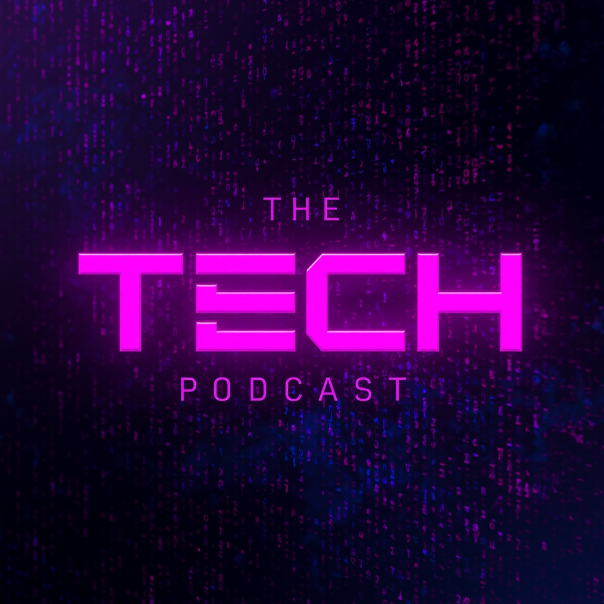

  

preview do podcast

# Projeto Podcast Gerado por I.A.s - ADS

> ℹ️ NOTE: Este é o repositório desenvolvido para o desafio prático da **DIO**, aplicando Inteligência Artificial na criação de conteúdos educacionais.

Projeto com o objetivo de gerar um podcast voltado para estudantes iniciantes em **Análise e Desenvolvimento de Sistemas**, discutindo o uso de IA como aliada no desenvolvimento.
Utilizar uma esteira de prompts para gerar cada etapa do processo criativo.

---

## 💻 Tecnologias utilizadas no projeto

* **[Gemini](https://gemini.google.com/):** Criação e refinamento do roteiro.
* **[Leonardo.ai](https://leonardo.ai/):** Criação de capas e identidade visual.
* **[CapCut](https://www.capcut.com/pt-br/):** Tratamento de áudio e adição de trilha sonora.

---

## ✨ Como foi feito?

* **Roteiro gerado via Gemini:** Focado nos desafios dos calouros de ADS.
* **Leonardo.ai para gerar capas:** Ilustração conceitual do tema.
* **Editor de áudio CAPCUT para tratar áudio e adicionar sons de fundo**.

---

## 📚 Materiais

* [Link do Roteiro e Prompts Detalhados](./prompts/roteiro-ia-ads.md)
* [Arquivo de Áudio Final (.mp3)](./output/)

---

## ⚙️ Instruções de execução

Utiliza os prompts e orientações estruturadas neste repositório para recriar ou acompanhar o projeto, seguindo o passo a passo abaixo:

* 🤖 1. Utilize os prompts estruturados no **[Gemini](https://gemini.google.com/)** para refinar o roteiro.
* 🎙️ 2. Faça a gravação da narração com a sua própria voz utilizando o roteiro estruturado.
* 🎨 3. Utilize os prompts gerados no **[Leonardo.ai](https://leonardo.ai/)** (ou outra ferramenta de sua preferência) para criar a capa.
* ✂️ 4. Faça o tratamento final do áudio e a montagem no **[CapCut](https://www.capcut.com/pt-br/)**.

---

## 🧑‍💻 Autora

<table style="border: none;">
  <tr>
    <td align="center" style="border: none;">
      <a href="https://github.com/amandkz">
         
        <b>Amanda</b>
      </a>
    </td>
    <td style="border: none; vertical-align: middle; padding-left: 20px;">
      <a href="https://github.com/amandkz" target="_blank">GitHub</a> | 
      <a href="https://www.linkedin.com/in/vasconceloscontato" target="_blank">LinkedIn</a> | 
      <a href="https://instagram.com/amandkz" target="_blank">Instagram</a>
    </td>
  </tr>
</table>

---

Feito com 💜 por Amanda Vasconcelos

